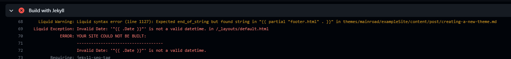
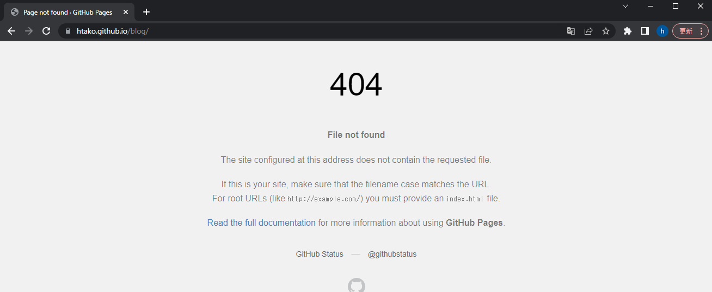

## github actionsに失敗した

pushした後自動的にhugoのbuildに入るが `Build with Jekyll` というステージで失敗する。

```
  Liquid Exception: Invalid Date: '"{{ .Date }}"' is not a valid datetime. in /_layouts/default.html
             ERROR: YOUR SITE COULD NOT BE BUILT:
                    ------------------------------------
                    Invalid Date: '"{{ .Date }}"' is not a valid datetime.
```



問題を解消しようと調べたが、そもそもこのフェーズってあんまり想定してなかったよなと思い、色々調べていくうちに .nojekyll という空ファイルを作ることで jekyll のフェーズをスキップできるらしいという知見を得る。

https://github.blog/2009-12-29-bypassing-jekyll-on-github-pages/

やってみたら、確かにステージがなくなって、buildも通った。

## content フォルダの下のコンテンツの配置について

hugo は content フォルダの下にあるファイルをwebコンテンツとして書き出してくれるらしい。
また、そのパスはあまり重要でなく、良しなにやってくれるらしい。
画像を張るときには index.md というファイル名にするとうまいことやってくれるという話のようなので、パスとしては

```
content
  -- posts
    -- 20230507
      -- index.md
      -- image.png
    -- 20230508
      -- index.md
      -- image.png
    -- ...
```

というような感じで配置するのがよさそう。  
ファイル数多くなってくるとつらくなる可能性はあるが、それはその時ということで。

## hugo コマンドでパスとmdファイルは作れるらしい

```
hugo new posts/20230507/index.md
```

とすれば、content/posts/20230507/index.md が作成されるらしい。
実際に作ってみると、ファイルの中身は以下のようになっていた。

```
---
title: "20230507"
date: 2023-05-07T15:01:38+09:00
categories: [""]
tags: [""]
---
```

何かのテンプレートから作っているのだろうと思い、調べてみると、archetypes というフォルダの default.md から作っていそう。

```
---
title: "{{ replace .Name "-" " " | title }}"
date: {{ .Date }}
categories: [""]
tags: [""]
---
```

default.md という名前から推測するに、指定の仕方でいくつかテンプレートを用意して使い分けることができそう。この辺はのちのち調べることにする。

## build が通ったがページが表示されない

そして一番の問題。  
そう、ページが表示されない。  
このポストを書いている今、このポストを表示する見込みがない。  
これを解消しないといけない。


